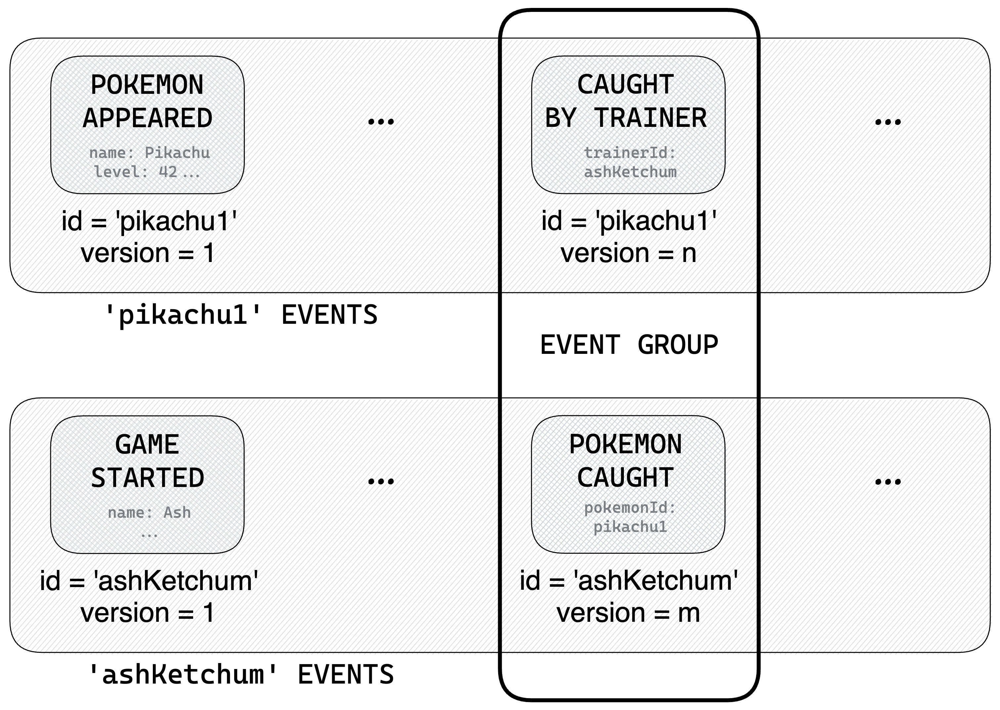

# 🔗 Joining data

Some commands can have an effect on **several event stores**, or on **several aggregates** of the same event store. For instance, the `CATCH_POKEMON` command could write both a `CAUGHT_BY_TRAINER` event on a pokemon aggregate (changing its `status` to `'caught'`) and a `POKEMON_CAUGHT` event on a trainer aggregate (appending the `pokemonId` to its `pokedex`).



To not have your application in a corrupt state, it's important to make sure that **all those events are pushed or none**. In Castore, this can be done through the **event groups** API:

- You can use the `groupEvent` method to build an array of events that are to be pushed together. It has the same input interface as `pushEvent` but synchronously returns a `GroupedEvent` class.
- The `EventStore` class exposes a static `pushEventGroup` method that can be used to effectively push this event group.

```ts
await EventStore.pushEventGroup(
  pokemonsEventStore.groupEvent({
    // 👇 Correctly typed
    aggregateId: 'pikachu1',
    type: 'CAUGHT_BY_TRAINER',
    payload: { trainerId: 'ashKetchum' },
    ...
  }),
  trainersEventStore.groupEvent({
    aggregateId: 'ashKetchum',
    type: 'POKEMON_CAUGHT',
    payload: { pokemonId: 'pikachu1' },
    ...
  }),
);
```

:::note

Think of event groups as _"what JOINS would be in CRUD"_

:::

Like the `pushEvent` API, event groups are designed to throw an `EventAlreadyExistsError` if the transaction has failed, making sure that commands are retried as expected when race conditions arise.

:::info

☝️ When pushing event groups on several event stores, they must use the **same event storage adapter** class.

:::

:::info

☝️ Also, be aware of technical constraints of your event storage solution. For instance, the [`DynamoDBEventStorageAdapter`](https://www.npmjs.com/package/@castore/dynamodb-event-storage-adapter)'s implementation is based on [DynamoDB transactions](https://docs.aws.amazon.com/amazondynamodb/latest/developerguide/transaction-apis.html), which means that the event stores tables must be in the same region, and that a group cannot contain more than 100 events.

:::
