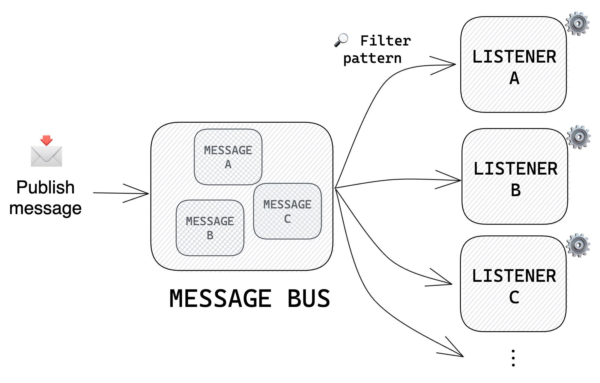

# 🚌 Message Buses

[Message Buses](https://en.wikipedia.org/wiki/Publish%E2%80%93subscribe_pattern) are used to spread messages to multiple **listeners**. Contrary to message queues, they do not store the message or wait for the listeners to respond. Often, **filter patterns** can also be used to trigger listeners or not based on the message content.



You can use the `AggregateExistsMessageBus`, `NotificationMessageBus` or `StateCarryingMessageBus` classes to implement message buses:

```ts
import { NotificationMessageBus } from '@castore/core';

const appMessageBus = new NotificationMessageBus({
  messageBusId: 'APP_MESSAGE_BUSES',
  sourceEventStores: [pokemonsEventStore, trainersEventStore...],
});

await appMessageBus.publishMessage({
  // 👇 Typed as NotificationMessage of one of the source event stores
  eventStoreId: 'POKEMONS',
  event: {
    type: 'POKEMON_LEVELED_UP',
    ...
  }
})

// Similar for AggregateExistsMessageBus and StateCarryingMessageBus
```

Similarly to event stores, `MessageBus` classes provide a boilerplate-free and type-safe interface to publish messages, but are NOT responsible for actually doing so. This is the responsibility of the `MessageBusAdapter`, that will connect it to your actual messaging solution:

```ts
import { EventStore } from '@castore/core';

await messageBus.publishMessage(...);
// ❌ Will throw an `UndefinedMessageChannelAdapterError`

const messageBus = new NotificationMessageBus({
  ...
  // 👇 Provide it in the constructor
  messageBusAdapter: mySuperMessageBusAdapter,
});

// 👇 ...or set/switch it in context later
messageBus.messageChannelAdapter = mySuperMessageBusAdapter;

await messageBus.publishMessage(...);
// 🙌 Will work!
```

:::info

You can code your own `MessageBusAdapter` (simply implement the `MessageChannelAdapter` interface), but we highly recommend using an [off-the-shelf adapter](../5-packages.md#-message-buses-adapters) (if the messaging solution that you use is missing, feel free to create/upvote an issue, or contribute 🤗).

:::

The adapter packages will also expose useful generics to type the arguments of your bus listeners. For instance:

```ts
import type { EventBridgeMessageBusMessage } from '@castore/event-bridge-message-bus-adapter';

const pokemonMessagesListener = async (
  // 👇 Specify that you only listen to the pokemonsEventStore messages
  eventBridgeMessage: EventBridgeMessageBusMessage<
    typeof appMessageQueue,
    'POKEMONS'
  >,
) => {
  // 👇 Correctly typed!
  const message = eventBridgeMessage.detail;
};
```

> <details>
> <summary><b>🔧 Reference</b></summary>
> <p></p>
>
> **Constructor:**
>
> - <code>messageBusId <i>(string)</i></code>: A string identifying the message bus
> - <code>sourceEventStores <i>(EventStore[])</i></code>: List of event stores that the message bus will broadcast events from
> - <code>messageBusAdapter <i>(?MessageChannelAdapter)</i></code>: Message bus adapter
>
> **Properties:**
>
> - <code>messageBusId <i>(string)</i></code>
>
> ```ts
> const appMessageBusId = appMessageBus.messageBusId;
> // => 'APP_MESSAGE_BUS'
> ```
>
> - <code>sourceEventStores <i>(EventStore[])</i></code>
>
> ```ts
> const appMessageBusSourceEventStores = appMessageBus.sourceEventStores;
> // => [pokemonsEventStore, trainersEventStore...]
> ```
>
> - <code>messageChannelAdapter <i>?MessageChannelAdapter</i></code>: Returns the associated message bus adapter (potentially undefined)
>
> ```ts
> const appMessageBusAdapter = appMessageBus.messageChannelAdapter;
> // => undefined (we did not provide one in this example)
> ```
>
> ☝️ The `messageChannelAdapter` is not read-only so you do not have to provide it right away.
>
> **Async Methods:**
>
> The following methods interact with the messaging solution of your application through a `MessageBusAdapter`. They will throw an `UndefinedMessageChannelAdapterError` if you did not provide one.
>
> - <code>publishMessage <i>(message: Message, opt?: OptionsObj = {}) => Promise(void))</i></code>: Publish a <code>Message</code> (of the appropriate type) to the message bus.
>
>   `OptionsObj` contains the following properties:
>
>   - <code>replay <i>(?boolean = false)</i></code>: Signals that the event is not happening in real-time, e.g. in maintenance or migration operations. This information can be used downstream to react appropriately. Check the implementation of you adapter for more details.
>
> - <code>publishMessages <i>(messages: Message[], opt?: OptionsObj) => Promise(void))</i></code>: Publish several <code>Messages</code> (of the appropriate type) to the message bus. Options are similar to the <code>publishMessage</code> options.
>
> - <code>getAggregateAndPublishMessage <i>((message: NotificationMessage) => Promise(void))</i></code>: _(StateCarryingMessageBuses only)_ Append the matching aggregate (with correct version) to a <code>NotificationMessage</code> and turn it into a <code>StateCarryingMessage</code> before publishing it to the message bus. Uses the message bus event stores: Make sure that they have correct adapters set up.
>
> **Type Helpers:**
>
> - <code>MessageChannelMessage</code>: Given a <code>MessageBus</code>, returns the TS type of its messages
>
> ```ts
> import type { MessageChannelMessage } from '@castore/core';
>
> type AppMessage = MessageChannelMessage<typeof appMessageBus>;
>
> // 👇 Equivalent to:
> type AppMessage = EventStoreNotificationMessage<
>   typeof pokemonsEventStore | typeof trainersEventStore...
> >;
> ```
>
> </details>
